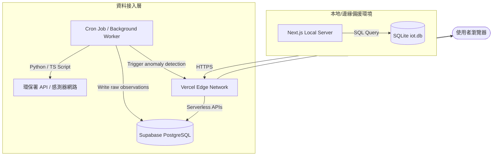
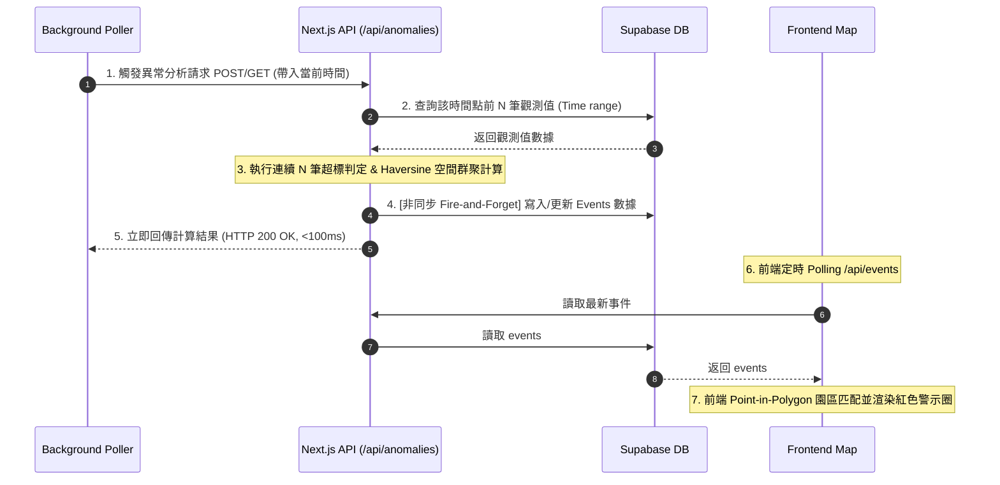

# 微感監測中心 - 工程交接與技術規格書精進指南

> **署名**：PST-Tim
> **定位**：致接手工程團隊之系統分析 (SA) 與架構交接說明

這份指南旨在提供將系統移交給工程團隊（上線與維運）時，規格書需要補強的關鍵技術細節。工程師最關心的核心是：**「如何部署、資料如何流動、如何監控、掛掉時如何復原」**。

---

## 1. 運維部署拓撲 (Deployment Topology)
規格書應包含下述拓撲結構，以說明 Serverless 與背景排程的協作：

---

## 2. 核心數據流時序圖 (Data Flow Sequence)
規格書中需附帶下圖，說明事件偵測的生命週期與非同步解耦機制：

---

## 3. 規格書精進的四個核心方向

### 📊 3.1 環境變數與秘密管理 (Secrets Management)
運維接手首先需要完整的環境變數清冊。規格書中應列出以下對照表：
*   `NEXT_PUBLIC_MAPBOX_ACCESS_TOKEN`：Mapbox 3D 地圖權杖（前端權限，限制 Domain）。
*   `SUPABASE_URL` 與 `SUPABASE_ANON_KEY`：Supabase 連線端點。
*   `SUPABASE_SERVICE_ROLE_KEY`：後端專用繞過 RLS 的 Master Key（嚴禁洩漏至前端）。
*   `DATABASE_URL`：本地 SQLite 路徑或外部 PostgreSQL Connection String。

### 🚨 3.2 非功能性需求與監控指標 (NFR & Observability)
工程師需要知道如何判定系統「活著且健康」：
*   **健康監測端點 (Health Check)**：指明可監控 <code>/api/completeness</code>，當完整率低於 70% 時，運維系統需向 PagerDuty/Slack 發送警報。
*   **API 頻率限制 (Rate Limiting)**：說明在高併發下，應在 Vercel Edge Component 或是 API 路由中使用 Redis 限流（Limit 100 req/min/IP），防止地圖點位遭惡意爬取。

### 🔄 3.3 錯誤容忍與災難復原 (Failover & Disaster Recovery)
當雲端服務中斷時的標準作業程序 (SOP)：
*   **Supabase 故障**：系統自動偵測並調用 SQLite 備援，前端拋出 Toast 提示「目前為本地離線模式」。
*   **數據補件機制**：若 Background Worker 因網路斷開漏掉數個時間點的 PM₂.₅，Poller 重新連線時必須支援「時間回補參數」（例如帶入 <code>?time=history_time</code>），重新補回漏掉的 Observations 與 Events。

### ⚙️ 3.4 後端背景任務維護 (Cron Specs)
*   說明 Python 排程腳本的執行頻率（建議每 5 分鐘執行一次，與觀測時間對齊）。
*   說明重試機制 (Retry Policy)：Poller 抓取外部 API 失敗時，應採取指數退避 (Exponential Backoff) 重試，最多 3 次。
